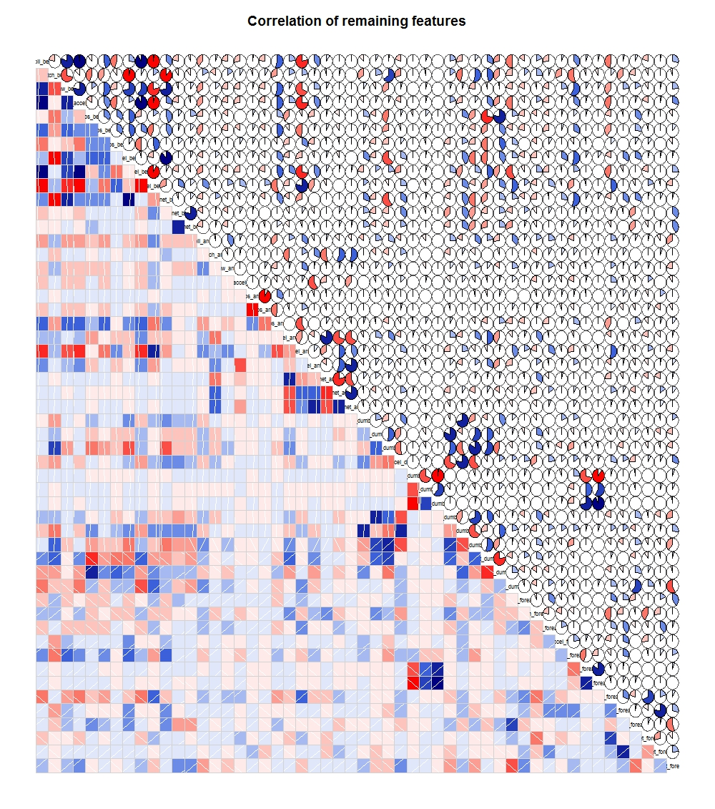

# Introduction
This report documents the Coursera Practical Machine Learning Assignment.

The objective of this assignment is to build an algorithm to predict the acitivity quality from a number of activity monitors place on a candidate's arm, forearm, waste and dumbell during a series of 5 exercises.  

The five exercises were carried out by a number of candiates and the sensor measurements were recorded in a comma separated file called pml-training.csv.

The key output of this assignment is to predict the Classe variable for a series of 20 test samples in a file called pml-testing.csv. These predictions will be submitted in a separate process for grading. 

The sections below cover the necessary steps used to produce the prediction algorithm, the design decisions and any assumptions used in the process.

## Design Decisions
Model type: Random forest. Tree type predictors have the benefit of being easier to interpret and display better performance in non-linear settings. Random forests have these and the additional benefits of having higher accuracy. 

Types of dimensionality reduction used: nearZeroValue, correlation, pca,

## Assumptions
- The correlation between the last 53 variables remaining in the set used to train the random forest were not highly correlated enough to warrant further subseting.

##Procedure:
1. The file pml-training.csv was spit into a training set (70%) and a cross-validation set (30%).

2. These two data sets were cleaned up using the following methods then the new training set was used to train the random forest model and the cross-validation set was used to test the predictive power of this random forest model.

3. Methods for cleaning and preparing the data for model training.
      a) remove catagorical variables from dataset including "X", "user_name", "raw_timestamp_part_1", "raw_timestamp_part_2", "cvtd_timestamp", "new_window ", "num_window".
	b) Remove any features that have little variance or information value using nearZeroVar().
	c) Remove columns with NA values in them.
	d) Look at the correlation of the remaining attributes and decide whether they need to be reduced further.



## Cross Validation
The cross-validation set (30% data held out from the training set) was used to check the models performance by comparing the predictions of the random forest model with the real classe values.
  
The accuracy of the random forest model is 100% on the cross valiation set.

## What is the out of sample error rate
The out of sample error is:

$$ \textit{Out of Sample Error (MSE)} = \frac{1}{n}  \sum_{i=1}^{n} (Prediction_{i} - Truth_{i})^2  $$

The out of sample error, using mean squared error (MSE), for the random forest is 0. While the out of sample error for the regression model is 2624.452 (MSE).

This shows that the random forest model more accurately predicts the outcome of the classe variable than the regression model.

## Appendix
The following appendice documents the procedures that were carried out to produce the machine learning algorithm and the final outcomes.

### Load Data 
```{r cache=TRUE, warning=FALSE, message=FALSE}
# set working directory
setwd("~/Documents/Coursera/dataScienceSpecialisation/pracML/assignment")

# Load Data
file1 <- '/Users/andrewszwec/Documents/Coursera/dataScienceSpecialisation/pracML/assignment/pml-training.csv'
file2 <- '/Users/andrewszwec/Documents/Coursera/dataScienceSpecialisation/pracML/assignment/pml-testing.csv'

raw_train <- data.frame(read.csv(file1, header=TRUE))
raw_test <- data.frame(read.csv(file2, header=TRUE))

library(caret)
set.seed(975)
inTrain = createDataPartition(raw_train$classe, p = 0.7)[[1]]
training = raw_train[ inTrain,]     # 70% of records
testing = raw_train[-inTrain,]      # 30% of reocrds
```


### Remove categorical variables, leaving only the sensor readings
```{r cache=TRUE }
df <- raw_train[,8:ncol(raw_train)]
```

### Data Preparation
Take care of:  
- Near Zero Variance columns  
- Columns with NAs  
- Inspect Correlated variables  
 

```{r cache=TRUE}
require(caret)
## Find columns with near zero variance and remove them
df_nzv <- nearZeroVar(df, saveMetrics=TRUE)
remaining <- df_nzv[which(df_nzv$nzv==FALSE),]

df_all_var <- subset(df , select=rownames(remaining))

# Remove Columsn with NAs
df_rm_na <- df_all_var[ , colSums(is.na(df_all_var)) == 0]

# Find Correlated variables and then remove extra variables
df_corr <- cor(subset(df_rm_na, select=-classe))

## View the correlations between variables
#library(corrgram)
# Order = FALSE, panel.pie, panel.pts
#corrgram(df_rm_na, order=FALSE, lower.panel=panel.shade,
#         upper.panel=panel.pie, text.panel=panel.txt,
#         col.regions=colorRampPalette(c("red","salmon","white","royalblue","navy")),       
#        main="Correlation of remaining features")
```

### Build Random Forest Model using 19,622 records
```{r cache=TRUE}
set.seed(575656)
#### Load the parallel processing packages
#require(foreach)
#require(doMC)
#numCores = 8
#registerDoMC(cores=numCores)

### Run full model!
# mod_rf_full <- train(classe~ . 
#               ,method='rf'
#               ,allowParallel=TRUE
#               ,data = df_rm_na
#              )
# save(mod_rf_full, file = "mod_rf_full.RData")

load(file = "mod_rf_full.RData")
```

### Print the final model details for the Random Forest Model
```{r cache=TRUE}
print(mod_rf_full$finalModel)
```

### Look at the variable importance to the model 
```{r cache = TRUE}
varImp(mod_rf_full, useModel=TRUE)
```

### Use Random Forest model to predict values on the cross-validation set
```{r cache=TRUE}
rf_full_predictions <- predict(mod_rf_full, newdata = testing)
pred <- data.frame(rf_full_predictions, classe=testing$classe)
correct <- nrow(pred[with( which(rf_full_predictions==classe), data=pred ),])
wrong <- nrow(pred[with( which(rf_full_predictions != classe), data=pred ),])
percent_correct = correct/nrow(pred)*100
percent_correct
percent_wrong = wrong/nrow(pred)*100
percent_wrong
```

### The Out of sample error is...
```{r cache = TRUE}
out_of_sample_error <- 1/(length(rf_full_predictions)) * sum( ( wrong )^2 )
out_of_sample_error
```

### Train a regression model using a small random sample from the training set
```{r cache=TRUE}
set.seed(575656)
# Get a random sample from the data frame with the NA columns removed
rand_train_sample <- df_rm_na[sample(1:nrow(df_rm_na), 1000, replace=FALSE),] 

# Use this to train a quick regression model
# reg_mod <- train(classe~ . 
#               , method='rpart'
#               , preProcess=c('pca')
#               , data= rand_train_sample
#              )
# save(reg_mod, file = "reg_mod.RData") 
load(file = "reg_mod.RData")
print(reg_mod$finalModel)
# Plot Decision tree
library(rattle)
fancyRpartPlot(reg_mod$finalModel)
```
You can see that the regression model will only every predict Classe = A, B, D

### Use the regression model to predict the classe variable of the cross-validation set and calculate the out of sample error
```{r cache = TRUE}
reg_predictions <- predict(reg_mod, newdata = testing)
pred <- data.frame(reg_predictions, classe=testing$classe)
correct <- nrow(pred[with( which(reg_predictions==classe), data=pred ),])
wrong <- nrow(pred[with( which(reg_predictions != classe), data=pred ),])
percent_correct = correct/nrow(pred)*100
percent_correct
percent_wrong = wrong/nrow(pred)*100
percent_wrong
out_of_sample_error <- 1/(length(reg_predictions)) * sum( ( wrong )^2 )
out_of_sample_error
```


